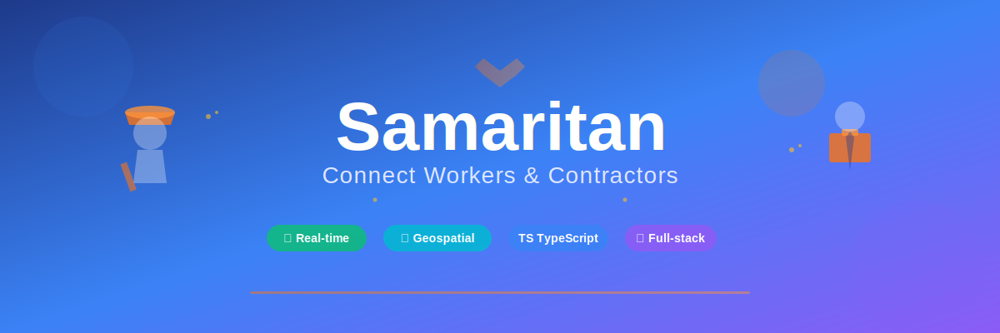

<div align="center">
  
</div>

<br/>

# Samaritan

A full-stack worker-contractor connection platform built with TypeScript. Connect day laborers with contractors for jobs ranging from general labor to specialized trades.

## Features

- **User Management** - Registration and authentication for workers, contractors, and admins
- **Job Marketplace** - Post, search, and apply for jobs with geolocation filtering
- **Contract Management** - Create contracts with milestones or hourly tracking
- **Real-time Messaging** - Direct messaging between workers and contractors
- **Payment Processing** - Stripe integration for secure payments
- **Reviews & Ratings** - Build reputation through verified reviews
- **Geospatial Search** - Find workers and jobs within a specified radius
- **Offline Support** - Queue actions when offline, sync when back online

## Tech Stack

### Backend
- **Runtime**: Node.js with TypeScript
- **Framework**: Express.js
- **Database**: PostgreSQL with PostGIS (geospatial queries)
- **Cache**: Redis
- **ORM**: Knex.js
- **Auth**: JWT + Passport.js (local, Google, Facebook, LinkedIn)
- **Payments**: Stripe
- **File Storage**: AWS S3
- **Real-time**: Socket.io

### Frontend
- **Framework**: React 18
- **State**: Redux Toolkit + RTK Query
- **Styling**: Tailwind CSS
- **Real-time**: Socket.io Client

## Prerequisites

- Node.js 18+
- PostgreSQL 15+ with PostGIS extension
- Redis 7+
- Docker (optional, for containerized setup)

## Quick Start

### Using Docker (Recommended)

```bash
# Start PostgreSQL and Redis containers
docker run -d --name samaritan-postgres \
  -e POSTGRES_USER=postgres \
  -e POSTGRES_PASSWORD=postgres \
  -e POSTGRES_DB=samaritan \
  -p 5432:5432 \
  postgis/postgis:15-3.3-alpine

docker run -d --name samaritan-redis \
  -p 6379:6379 \
  redis:7-alpine
```

### Installation

```bash
# Clone the repository
git clone https://github.com/albertoelopez/Samaritan.git
cd Samaritan

# Install dependencies
npm install

# Copy environment variables
cp .env.example .env
# Edit .env with your configuration

# Run database migrations
npm run migrate

# Seed the database
npm run seed

# Start development server
npm run dev
```

The API will be available at `http://localhost:3001`

## Environment Variables

Copy `.env.example` to `.env` and configure:

| Variable | Description |
|----------|-------------|
| `DATABASE_URL` | PostgreSQL connection string |
| `REDIS_URL` | Redis connection string |
| `JWT_SECRET` | Secret for signing JWT tokens |
| `JWT_REFRESH_SECRET` | Secret for refresh tokens |
| `STRIPE_SECRET_KEY` | Stripe API secret key |
| `AWS_ACCESS_KEY_ID` | AWS credentials for S3 |
| `GOOGLE_CLIENT_ID` | Google OAuth client ID |

See `.env.example` for the complete list.

## Commands

```bash
npm run dev       # Start dev server with hot reload
npm run build     # Compile TypeScript to JavaScript
npm start         # Run production server
npm test          # Run test suite
npm run lint      # Run ESLint
npm run migrate   # Run database migrations
npm run seed      # Seed database with sample data
```

## API Endpoints

### Authentication
| Method | Endpoint | Description |
|--------|----------|-------------|
| POST | `/api/v1/auth/register` | Register new user |
| POST | `/api/v1/auth/login` | Login user |
| POST | `/api/v1/auth/logout` | Logout user |
| POST | `/api/v1/auth/refresh` | Refresh access token |
| POST | `/api/v1/auth/forgot-password` | Request password reset |

### Jobs
| Method | Endpoint | Description |
|--------|----------|-------------|
| GET | `/api/v1/jobs` | List/search jobs |
| POST | `/api/v1/jobs` | Create new job |
| GET | `/api/v1/jobs/:id` | Get job details |
| PUT | `/api/v1/jobs/:id` | Update job |
| DELETE | `/api/v1/jobs/:id` | Delete job |
| GET | `/api/v1/jobs/nearby` | Find jobs by location |

### Applications
| Method | Endpoint | Description |
|--------|----------|-------------|
| POST | `/api/v1/applications` | Apply for a job |
| GET | `/api/v1/applications/job/:jobId` | Get job applications |
| PUT | `/api/v1/applications/:id/status` | Update application status |

### Contracts
| Method | Endpoint | Description |
|--------|----------|-------------|
| POST | `/api/v1/contracts` | Create contract |
| GET | `/api/v1/contracts/:id` | Get contract details |
| POST | `/api/v1/contracts/:id/milestones` | Add milestone |
| POST | `/api/v1/contracts/:id/time-entries` | Log time entry |

### Messages
| Method | Endpoint | Description |
|--------|----------|-------------|
| GET | `/api/v1/messages/conversations` | List conversations |
| POST | `/api/v1/messages/conversations` | Start conversation |
| GET | `/api/v1/messages/conversations/:id` | Get messages |
| POST | `/api/v1/messages/conversations/:id` | Send message |

### Payments
| Method | Endpoint | Description |
|--------|----------|-------------|
| POST | `/api/v1/payments/methods` | Add payment method |
| GET | `/api/v1/payments/methods` | List payment methods |
| POST | `/api/v1/payments/process` | Process payment |
| GET | `/api/v1/payments/transactions` | Transaction history |

### Reviews
| Method | Endpoint | Description |
|--------|----------|-------------|
| POST | `/api/v1/reviews` | Create review |
| GET | `/api/v1/reviews/user/:userId` | Get user reviews |
| GET | `/api/v1/reviews/user/:userId/summary` | Get rating summary |

## Project Structure

```
src/
├── __tests__/           # Test files
├── components/          # React components
│   ├── auth/           # Authentication forms
│   ├── common/         # Reusable UI components
│   ├── job/            # Job-related components
│   ├── layout/         # Layout components
│   ├── messaging/      # Chat interface
│   ├── profile/        # Profile components
│   ├── rating/         # Review components
│   └── search/         # Search components
├── config/              # Configuration files
├── controllers/         # Route handlers
├── db/
│   ├── migrations/     # Knex migrations
│   └── seeds/          # Seed data
├── features/            # Redux slices
├── middleware/          # Express middleware
├── models/              # Database models
├── routes/              # API routes
├── services/            # Business logic
├── store/               # Redux store setup
├── types/               # TypeScript types
├── utils/               # Utility functions
├── validators/          # Request validators
├── app.ts               # Express app setup
└── server.ts            # Server entry point
```

## Database Schema

The platform uses PostgreSQL with PostGIS for geospatial features:

- **users** - User accounts with roles (worker, contractor, admin)
- **worker_profiles** - Worker details with location (PostGIS point)
- **contractor_profiles** - Company information
- **categories** - Job categories (20 types)
- **jobs** - Job postings with location
- **job_applications** - Worker applications
- **contracts** - Agreements between workers and contractors
- **milestones** - Fixed-price contract milestones
- **time_entries** - Hourly contract time tracking
- **reviews** - Ratings and reviews
- **conversations/messages** - Messaging system
- **transactions** - Payment records
- **notifications** - User notifications

## User Roles

| Role | Permissions |
|------|-------------|
| **Worker** | Apply for jobs, track time, receive payments |
| **Contractor** | Post jobs, hire workers, manage contracts |
| **Admin** | Full platform access, user management |
| **Moderator** | Content moderation, dispute resolution |

## Job Categories

General Labor, Construction, Plumbing, Electrical, HVAC, Painting, Carpentry, Landscaping, Cleaning, Moving, Roofing, Flooring, Demolition, Concrete, Welding, Masonry, Drywall, Insulation, Fencing, Other

## Testing

```bash
# Run all tests
npm test

# Run with coverage
npm test -- --coverage

# Run specific test file
npm test -- src/__tests__/api/auth.test.ts
```

## License

MIT

## Contributing

1. Fork the repository
2. Create a feature branch (`git checkout -b feature/amazing-feature`)
3. Commit your changes (`git commit -m 'Add amazing feature'`)
4. Push to the branch (`git push origin feature/amazing-feature`)
5. Open a Pull Request
